## Нейроблоггер

AI-помощник для контент-мейкеров: генерация идей, интервьюирование и написание постов с сохранением авторского стиля  

  
  
  
  
  
  
    

Проект, который я выполнял в рамках **Школы Backend разработки в Яндексе**. 
У нас была крупная команда , (15+ человек: PM, аналитики, дизайнеры, frontend, backend, mobile, QA, DevOps)
Все это было сделано, чтобы дать почувствовать обучающимся опыт работы в большой команде.

### Проблема и цель

Контент-мейкеры тратят часы на генерацию идей и написание постов в едином стиле.  
Нейроблоггер автоматизирует процесс: загружаешь примеры → система анализирует стиль → предлагает темы → интервьюирует → генерирует текст.

### Моя роль

Я руководил командой backend разработки, в мои задачи, помимо совместной разработки, входило:

- Распределение задач и code review  
- Координация с другими командами (frontend, аналитики, ML)  
- Архитектурные решения и контроль сроков/качества

### Ключевые технические решения

- **Микросервисная архитектура** для масштабируемости и отказоустойчивости  
- **API Gateway** — Nginx  
- **Авторизация** — OAuth 2.0 (Сервер авторизации Яндекса)  
- **Внешние интеграции** — Yandex Search (поиск инфоповодов), Yandex GPT (генерация вопросов и текстов)  
- **Хранение** — PostgreSQL (структурированные данные) + S3 (файлы, загруженные тексты)  
- **Обмен данными**: все сервисы были написаны на **REST**, но в качестве эксперимента часть внутренних сервисов была переписана на **gRPC** (был прирост +20–30% к скорости, но пришлось отменить из-за дедлайнов)  
- **Стэк**: один сервис (NeuroService) на **Python + FastAPI** (вырос из MVP аналитиков), остальные — **Java + Spring Boot**

Архитектура (схема)
  

  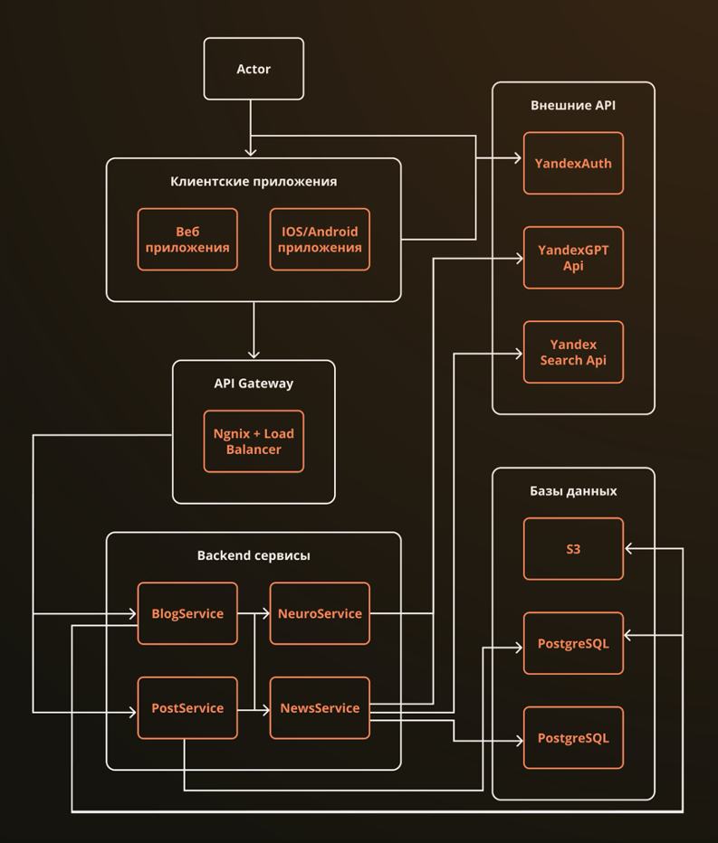  
  Микросервисы, API Gateway, внешние API, базы и хранилища

Схема базы данных

  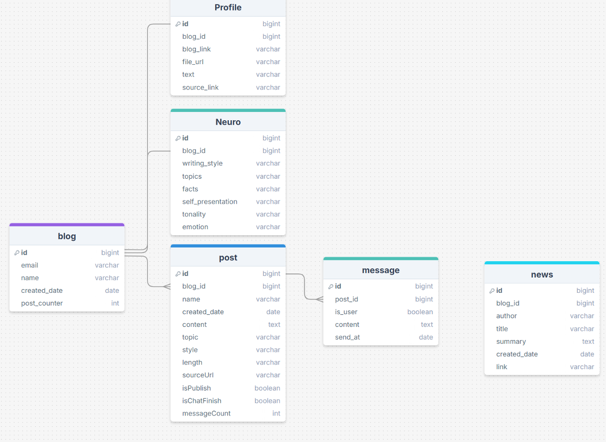  
  Структура таблиц

*Структура таблиц: поставщики, условия, расчёты*

### Результаты 
- Полностью функциональное приложение, поднятое в облаке (доступно для всех на момент презентации) 
- Все задачи выполнены в срок, проект прошёл приёмку 
- После демо куратор представил проект менеджерам Яндекса, для возможности монетизации и интеграции в экосистему Яндекса

## Сервис генерации коммерческих предложений для турагентства

Автоматизация создания персонализированных тур-предложений для корпоративных клиентов (MICE-сегмент: конференции, выездные мероприятия, командировки)

  
  
  

Этот проект я выполнил во время работы в стартапе, у нас была небольшая команда (3-4 человека)
Заказчик: владелец турагентства в Катаре

### Бизнес-проблема

Менеджеры тратили **3+ дня** на сбор данных, расчёт и формирование предложений → клиенты уходили к конкурентам из-за долгого ответа.  
Цель: сократить время подготовки до часов, сохранив качество и персонализацию.

### Моя роль

Полноценная backend разработка (основная ответственность за всю серверную часть):  

- Проектирование и реализация core-логики  
- Интеграция с ElasticSearch для быстрого поиска поставщиков  
- Авторизация и безопасность

### Ключевые технические решения

- Стэк — Java + Spring Boot (REST API)  
- **Поиск и индексация** — ElasticSearch (данные отелей, ресторанов, курортов обновляются редко → полная индексация для мгновенного поиска по сложным условиям)  
- **Авторизация** — JWT + Refresh Tokens  
- **AI-агент** — агрегация подходящих объектов → генерация нескольких вариантов предложений → выбранный вариант → экспорт в Excel / PPT  
- **Хранение** — реляционная БД (структура схем ниже)

Архитектура (схема)

  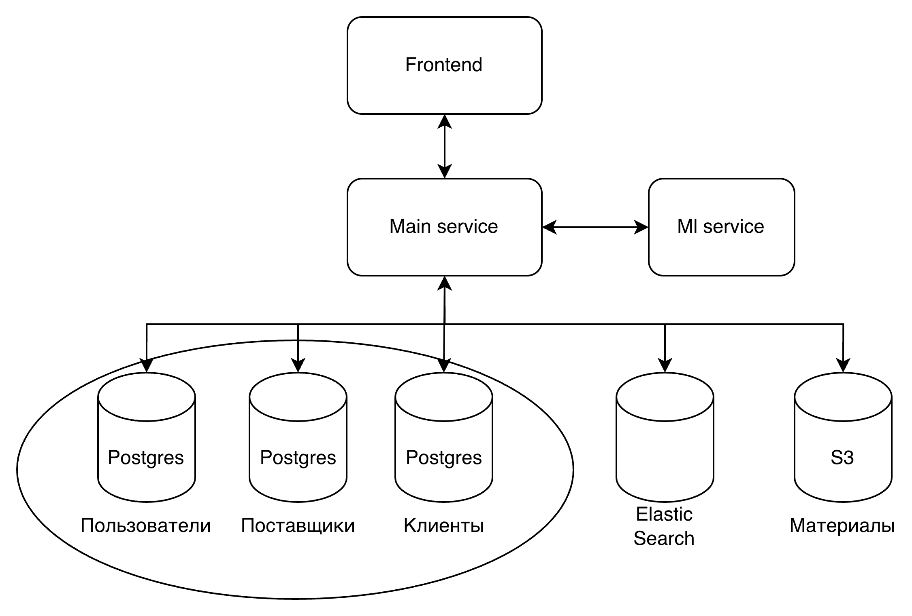  
  Компоненты системы и взаимодействие сервисов

Схема базы данных

  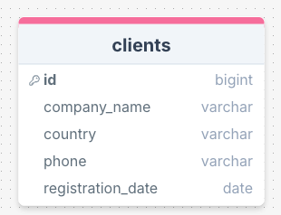
  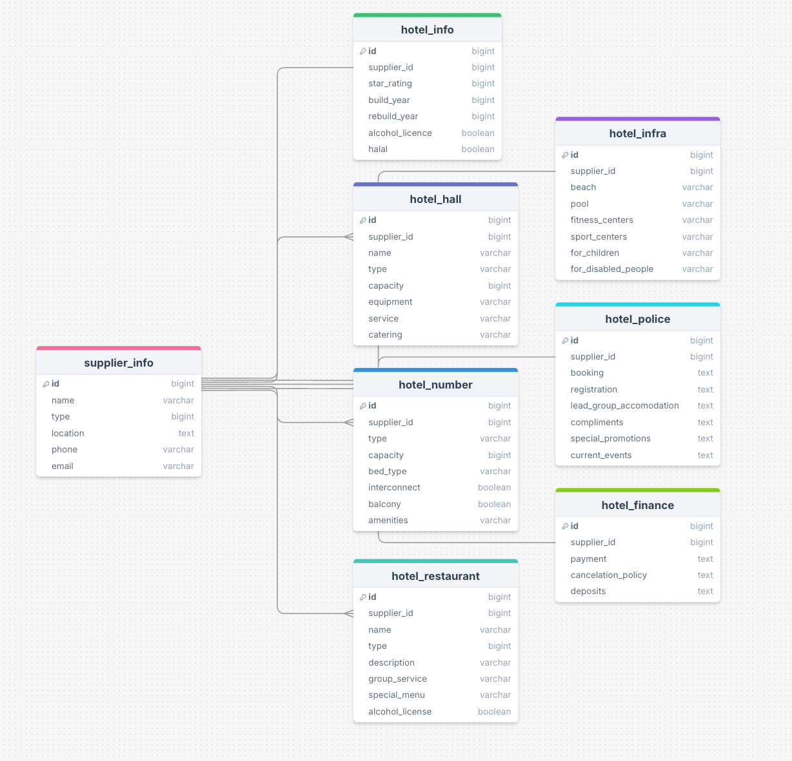
  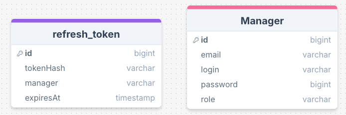  
  Структура таблиц: поставщики, условия, расчёты

*Структура таблиц: поставщики, условия, расчёты*

### Результаты и влияние

- Сокращение времени подготовки предложения **с 3 дней до нескольких часов**  
- Повышение скорости ответа клиентам → рост конверсии и удержания

## Система распознования дефектов сварных швов на рентгеновских снимках

Автоматизированный поиск дефектов на поверхности шва перед рентген-контролем для ускорения экспертизы на объектах АЭС

  
  
  

Данный проект был выполнен в рамках проектной практики  для **АО "АСЭ" (Росатом)**
Командный проект (10 человек, PM, аналитики, разработчики(backend + ml)) 

### Бизнес-проблема и цель

На строительстве АЭС каждый сварной шов проходит рентген-контроль → экспертиза занимает **до недели**.  
Цель: внедрить предварительный этап — цифровой скан поверхности шва → автоматическое распознавание видимых дефектов → если дефекты найдены, рентген можно не выполнять.

### Моя роль

**Backend-разработчик + ML-инженер**:  

- Разработка серверной части (API, обработка запросов, рендеринг интерфейса)  
- Дообучение модели YOLO 11 на предоставленных данных АСЭ

### Ключевые технические решения

- **Backend** — Python + aiohttp (асинхронный веб-сервер) + Jinja2 (шаблонизатор для простого веб-интерфейса)  
- **Архитектура** — MVC (Model-View-Controller)  
- **Модель** — YOLO 11 (дообучена на реальных рентгеновских снимках от АСЭ)  
- **Хранение** — CSV-файлы (без БД для минимизации зависимостей и упрощения деплоя)  
- **Процесс** — загрузка изображения → инференс модели → вывод дефектов (bounding boxes + вероятности) → визуализация результатов

Бизнес-процесс (схема)

  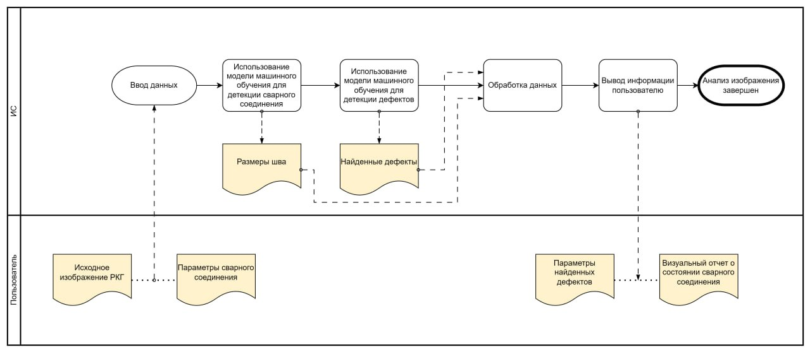  
  Схема интеграции предпроверки в процесс контроля качества

Элементы интерфейса и результаты

  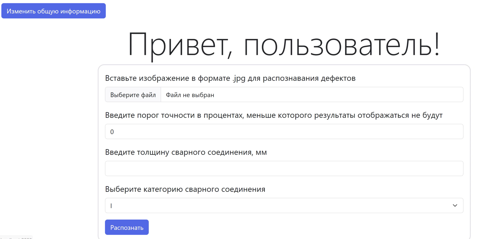
  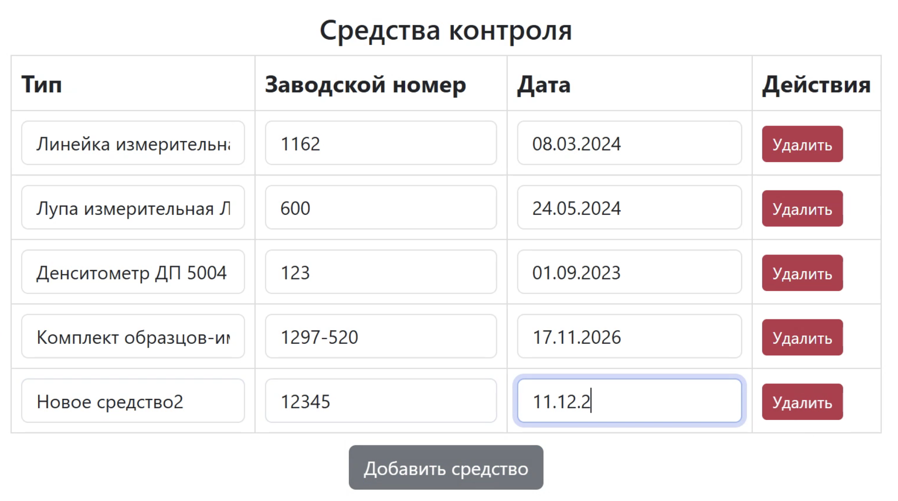  
  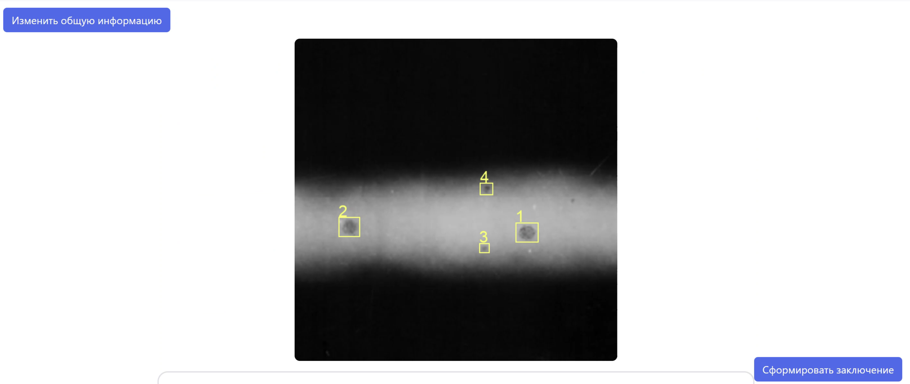
  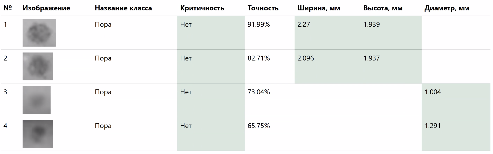  
  Загрузка снимка, визуализация bounding boxes, вывод вероятностей

### Результаты и влияние

- Проект прошёл приёмку и представлен заказчику 
- Успешно внедрён дополнительный этап предпроверки → потенциальное сокращение нагрузки на лабораторию и ускорение экспертизы критических швов 
- Модель дообучена на реальных промышленных данных → удалось добиться точности на валидационной выборке mAp-50 0.92.

## Подсистема безопасного запуска пользовательских скриптов

Изолированная "песочница" для загрузки, редактирования и выполнения пользовательского кода в информационной системе АО "Концерн Росэнергоатом".

  
  
  

Этот проект был выполнен в рамках госконтракта для **АО "Концерн Росэнергоатом"**
Одиночный проект.

### Бизнес-проблема и цель

В программно-техническом комплексе моделирования процессов очистки радиоактивных отходов требовалось ускорить разработку и отладку математических моделей.  
Ранее модели описывались в виде JavaScript скриптов и были децентрализованы, что было неудобно для пользователей и замедляло процесс разработки новых моделей.
Цель: дать пользователям (математикам, инженерам) возможность загружать и запускать на сервере собственные Python скрипты без риска для основной системы и инфраструктуры.

### Моя роль

**Backend-разработчик** (основная ответственность за новую подсистему):  

- Проектирование и реализация механизма изоляции  
- Создание сервисов для загрузки, редактирования, запуска и получения результатов  
- Интеграция с существующим монолитным приложением  
- Обеспечение безопасности и соответствия требованиям критической инфраструктуры

### Ключевые технические решения

- **Архитектура** — расширение монолита новыми бизнес-сервисами  
- **Изоляция** — каждый запуск пользовательского скрипта происходит в **отдельном Docker-контейнере** (с минимальным образом, входными данными и скриптом)  
- **Жизненный цикл**:
  - Загрузка/редактирование скрипта → валидация  
  - Запуск → создание контейнера → выполнение → сбор логов/результатов → удаление контейнера
- **Безопасность** — полная изоляция (нет доступа к хост-системе, ограниченные ресурсы по памяти, таймауты)  
- **Интеграция** — REST API для взаимодействия с основной системой  
- **Тестирование** — локальный запуск в Docker Compose.

Архитектура подсистемы

  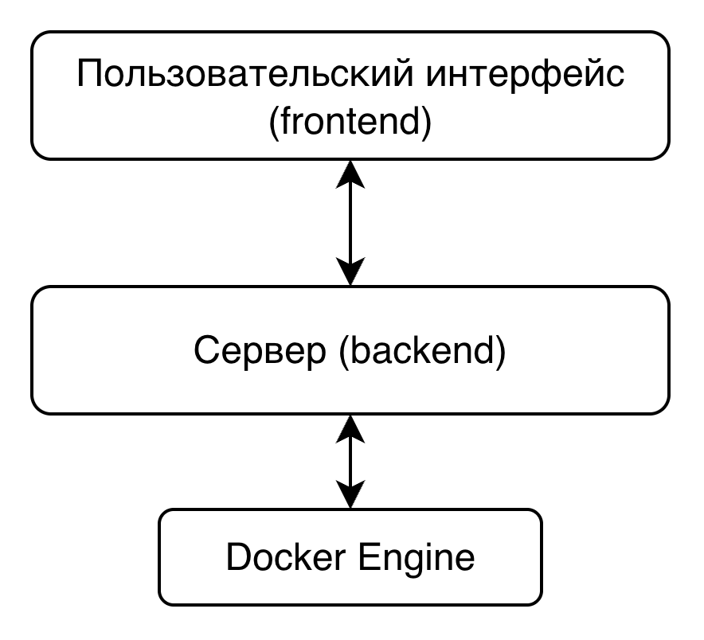  
  Монолит → новые сервисы → Docker → возврат результатов

Схема работы

  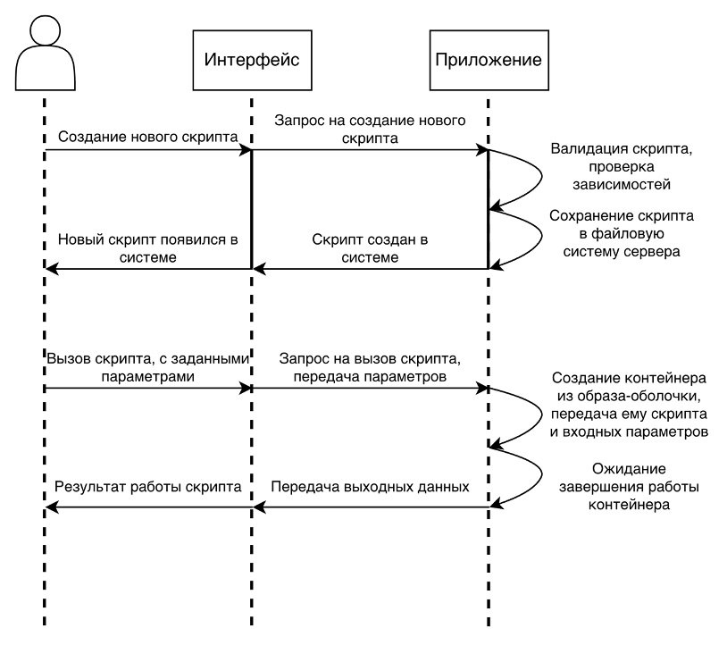  
  Процесс от загрузки скрипта до получения результата

### Результаты и влияние

- Успешно реализована и внедрена новая функциональность в production-систему  
- Значительное ускорение итераций при разработке математических моделей
- Обеспечена изоляция выполнения произвольного кода
- Проект прошёл все этапы приёмки и успешно сдан заказчику  
- Опыт работы с **госконтрактом** и требованиями к ПО для объектов использования атомной энергии

## Калькулятор маны (AtomHack 202X)

Веб-приложение для оптимального распределения героев по задачам с минимальными затратами маны (фэнтезийный кейс хакатона)

  
  
  

**Хакатон AtomHack** 
Командный проект (6 человек: аналитики, дизайнер, backend, frontend)

### Задача кейса

Распределить ограниченное количество героев по различным задачам/квестам так, чтобы:  

- каждая задача была выполнена  
- общая стоимость маны была минимальной  
- учитывались требования по уровню маны для каждой задачи и способности героев

### Моя роль

**Backend-разработчик** ( за серверную часть и алгоритм оптимизации):  

- Разработка бизнес логики, контейнеризация
- Формулировка и решение задачи линейного программирования
- Интеграция с frontend
- Работа с базой данных (структура героев, задач, матрицы стоимостей)

### Ключевые технические решения

- **Backend** — Java + Spring Boot (монолит — оптимально для скорости хакатона)  
- **Оптимизация** — линейное программирование (LP) через библиотеку **ojAlgo** (pure Java, без внешних солверов)  
- **База данных** — PostgreSQL  
- **Frontend** — Vue.js (интерактивный ввод данных и визуализация распределения)  
- **API** — REST endpoints: загрузка входных данных → расчёт оптимального распределения → возврат плана и итоговой стоимости

Архитектура

  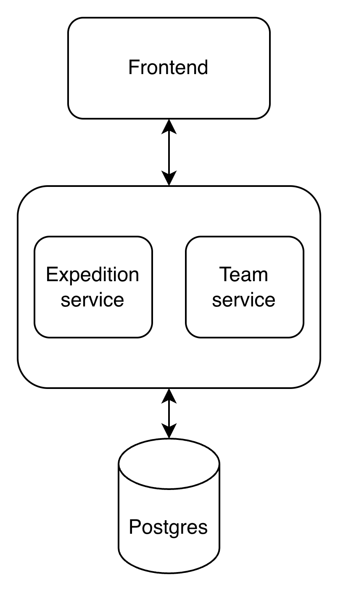  
  Компоненты приложения и поток данных

Структура базы данных

  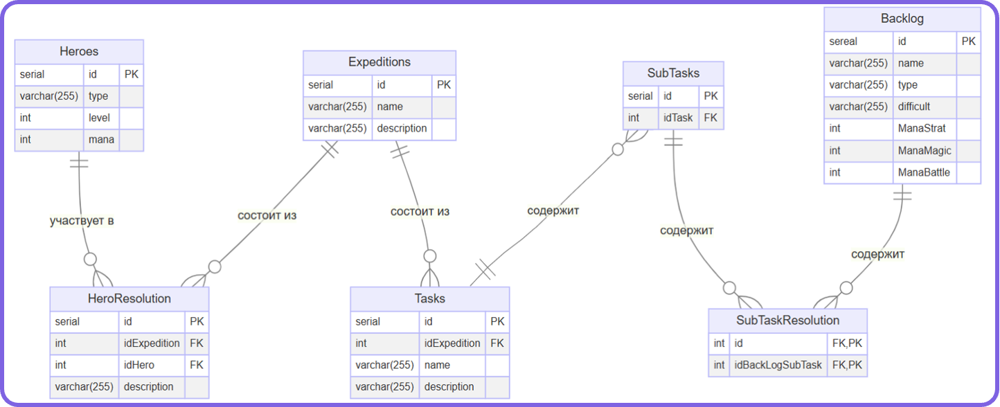  
  Таблицы: герои, задачи, связи и стоимости маны

Элементы интерфейса

  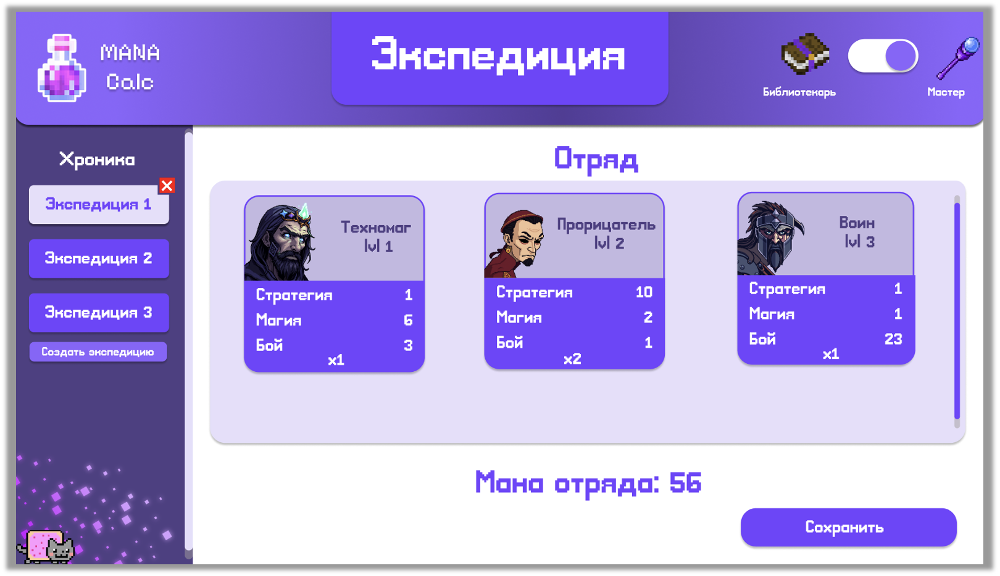
  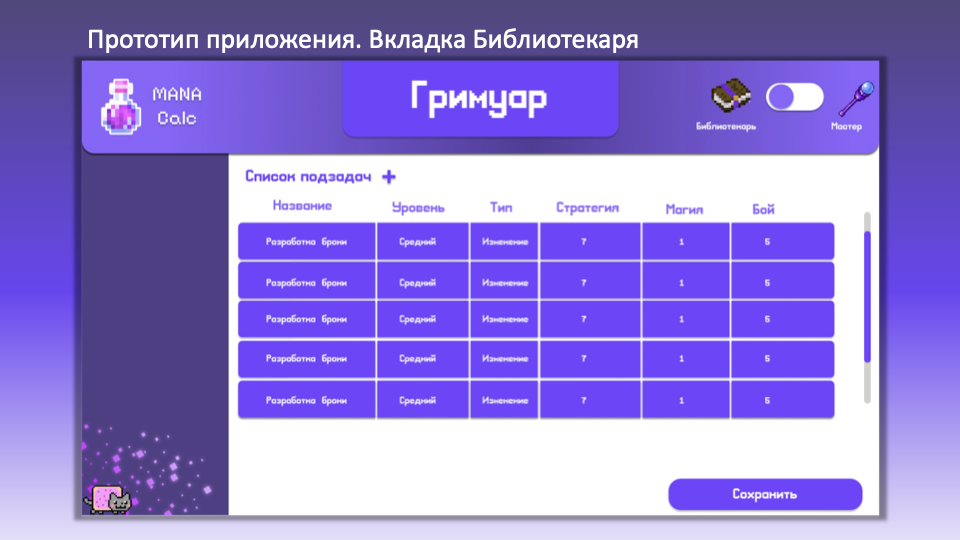
  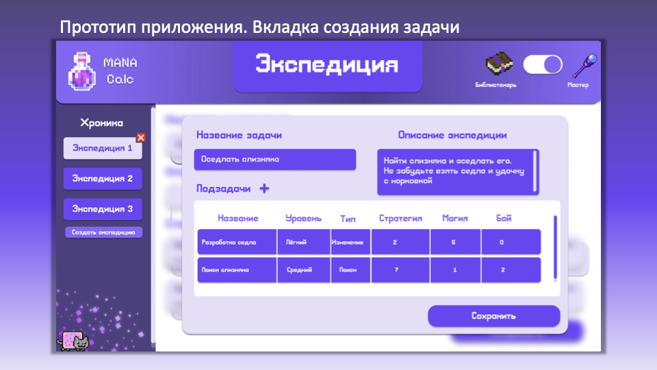  
  Ввод данных, визуализация оптимального распределения, итоговая стоимость маны

### Результаты и влияние

- Полностью рабочий прототип, успешно презентован на хакатоне  
- Алгоритм на ojAlgo находил **оптимальное** (или близкое к оптимальному) распределение за секунды даже на 20–50 героях/задачах  
- Получен интересный и полезный опыт

